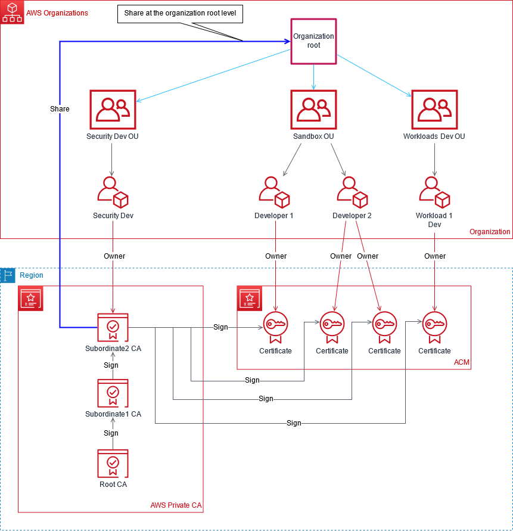
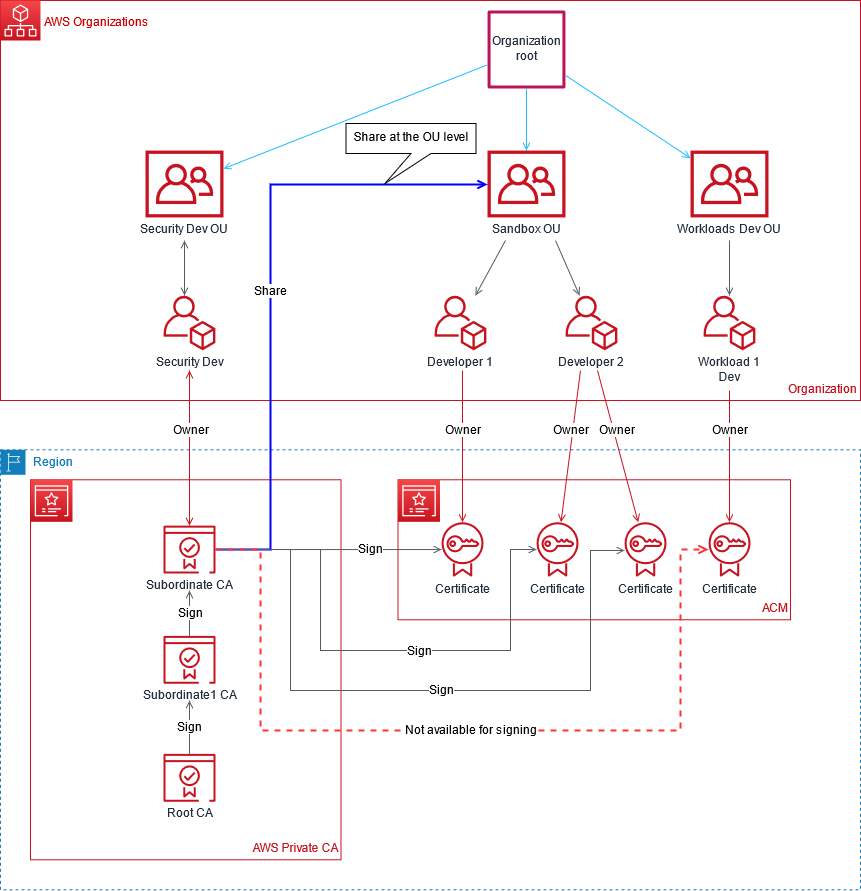

# AWS Certificate Manager (ACM) Private CA (PCA) shared to AWS Organizations via AWS Resource Access Manager (AWS RAM)

Large organizations often build a public key infrastructure (PKI) inside the AWS cloud, intended for private use within an organization. With AWS Certificate Manager (ACM) Private CA (PCA), you create your own CA hierarchy and issue certificates with it for authenticating internal users, computers, applications, services, servers, and other devices, and for signing computer code. Certificates issued by a private CA are trusted only within your organization, not on the public internet.

AWS Resource Access Manager (AWS RAM) allows you to securely share AWS resources within your AWS Organization. Private CA Cross-Account Sharing, gives you the ability to grant permissions for other accounts to use a centralized CA to generate and issue certificates while using the AWS RAM to manage the permissions. This removes the need for a Private CA in every account, saving you money for each CA created, which is a more cost-effective way of deployment. 

See also:  
[Designing a CA hierarchy](https://docs.aws.amazon.com/acm-pca/latest/userguide/ca-hierarchy.html)  
[Creating a private CA and CRL](https://docs.aws.amazon.com/acm-pca/latest/userguide/PcaCreateCa.html)  
[How to use AWS RAM to share your ACM Private CA cross-account](https://aws.amazon.com/blogs/security/how-to-use-aws-ram-to-share-your-acm-private-ca-cross-account/)

This solution has following features and benefits:

- Centralize and simplify management of the private CA hierarchy using AWS ACM Private CA.
- Export certificates and keys to customer managed devices in AWS and on-premises.
- Uses an AWS CloudFormation template for a rapid deployment and consistent provisioning experience.
- Create a private root CA along with either 1, 2, 3 or 4 subordinate CA hierarchy.
- Create an optional AWS RAM to share the end-entity subordinate with other accounts at the Org or OU level.
- Save money by removing the need for a private CA in every account by using AWS RAM.
- Create an optional S3 bucket for Certificate Revocation List (CRL).
- Create an optional S3 bucket for CRL access logs.

# Usage

- Use the AWS CloudFormation template via either the AWS console or AWS Command Line Interface (CLI).  
- The template parameter descriptions walk you through the console usage.  
- See the Test Cases below for CLI usage.  

# Prerequisites

- All CAs will reside in a single account and in a single region.
- Customer generated certificates and keys are NOT required to be imported into the CA.
- The CRL bucket does not require public access. Best practice recommends keeping the CRL private. If internet access to the CRL is required, see using Amazon CloudFront to serve the CRLs within the [Enabling the S3 Block Public Access feature](https://docs.aws.amazon.com/acm-pca/latest/userguide/PcaCreateCa.html#s3-bpa) of the AWS Private Certificate Authority documentation.

Use this solution in an AWS Organization environment needing multi-level hierarchy CA or alternatively implement the solution without AWS RAM sharing within a single account. See the AWS whitepaper for [Recommended OUs](https://docs.aws.amazon.com/whitepapers/latest/organizing-your-aws-environment/recommended-ous.html). 

To use this solution with AWS Organizations, the following is recommended:
- Use a Security account for creating the CA Hierarchy and the share.
- Use a separate OU (e.g. Sandbox OU) with one or more accounts for testing certificate management.
- [Enable sharing](https://docs.aws.amazon.com/ram/latest/userguide/getting-started-sharing.html#getting-started-sharing-orgs) within the management account.

This solution provides two options for sharing to AWS Organizations:
- **Option 1** Create the share at Org level. All accounts in the organization will be able to issue the private certificates using the shared CA.



- **Option 2** Create the share at the OU level. Only the accounts in the OU will be able to issue the private certificates using the shared CA. For example, if the share is created at the Sandbox OU level then both Developer 1 and Developer 2 will be able to the issue private certificates using the shared CA.



# Alternatives

This solution provides a single AWS Region, CA hierarchy with optional cross-account sharing via AWS RAM. ACM Private CA is a regional service so this solution only allows sharing cross-account within the same AWS Region. However, alternate usage patterns could be applied to this solution either by extending it or manually creating additional resources. Some examples of alternate usage patterns are:

- A CA hierarchy with the root outside of AWS
    - Subordinates will need to be signed and activated manually
- A CA hierarchy with some subordinates outside of AWS
    - Use this solution to create the single AWS Region CA hierarchy, then manually add subordinates from outside of AWS
- A CA hierarchy all within AWS but involving multiple AWS Regions
    - Create the regional CA hierarchy with this solution, then manually add a subordinate hierarchy to the original root CA in other AWS Regions. See https://docs.aws.amazon.com/acm-pca/latest/userguide/PcaExternalRoot.html for more information.

# Test Cases

The solution is tested for the following test cases using the parameter files.

- `testStackL0.json`
    - Root CA, ***no subordinate CAs***, CRL bucket, log bucket with OU level share. This is just for testing. *This is not a recommended approach*.
- `testStackL1.json`
    - Root CA, ***1 subordinate CA***, CRL bucket, log bucket with OU level share.
- `testStackL2.json`
    - Root CA, ***2 subordinate CAs***, CRL bucket, log bucket with OU level share.
- `testStackL3.json`
    - Root CA, ***3 subordinate CAs***, CRL bucket, log bucket with OU level share.
- `testStackL4.json`
    - Root CA, ***4 subordinate CAs***, CRL bucket, log bucket with OU level share.
- `testStack-NoCRL.json`
    - Root CA, 1 subordinate CA, ***no CRL bucket, no log bucket*** with OU level share.
- `testStack-NoLogBucket.json`
    - Root CA, 1 subordinate CA, CRL bucket, ***no log bucket*** with OU level share.
- `testStackL4-orgShare.json`
    - Root CA, 4 subordinate CAs, no CRL bucket, no log bucket with ***Org level share***.
- `testStackL4-noShare.json`
    - Root CA, 4 subordinate CAs, no CRL bucket, no log bucket and ***no share***. This is just for testing. *This is not a recommended approach*. 

Use the AWS CLI for easy testing. ***Make sure you are using the security account within the shared services OU***  
*Modify the parameter files with your management account, orgID, OU and bucket names*

```
aws cloudformation create-stack --stack-name testStack-L0 --template-body file://ACMPCA-RootCASubCA.yaml --parameters file://testStackL0.json
```
```
aws cloudformation create-stack --stack-name testStack-L1 --template-body file://ACMPCA-RootCASubCA.yaml --parameters file://testStackL1.json
```
```
aws cloudformation create-stack --stack-name testStack-L2 --template-body file://ACMPCA-RootCASubCA.yaml --parameters file://testStackL2.json
```
```
aws cloudformation create-stack --stack-name testStack-L3 --template-body file://ACMPCA-RootCASubCA.yaml --parameters file://testStackL3.json
```
```
aws cloudformation create-stack --stack-name testStack-L4 --template-body file://ACMPCA-RootCASubCA.yaml --parameters file://testStackL4.json
```
```
aws cloudformation create-stack --stack-name testStack-NoCRL --template-body file://ACMPCA-RootCASubCA.yaml --parameters file://testStack-NoCRL.json
```
```
aws cloudformation create-stack --stack-name testStack-NoLogBucket --template-body file://ACMPCA-RootCASubCA.yaml --parameters file://testStack-NoLogBucket.json
```
```
aws cloudformation create-stack --stack-name testStack-orgShare --template-body file://ACMPCA-RootCASubCA.yaml --parameters file://testStackL4-orgShare.json
```
```
aws cloudformation create-stack --stack-name testStack-noShare --template-body file://ACMPCA-RootCASubCA.yaml --parameters file://testStackL4-noShare.json
```

## Certificate Lifecycle Tests

AWS CLI or AWS Console can be used to test the private certificate lifecycle.  
You must switch account to test certificate lifecycle. Switch to an account in the Org or OU where the share is created.

See the sample AWS CLI command below:

```
# Request Certificate. Use the CA ARN from the output of AWS CloudFormation template stack.
aws acm request-certificate --domain-name test1.example.com --options CertificateTransparencyLoggingPreference=DISABLED --certificate-authority-arn arn:aws:acm-pca:<region>:<sec-account>:certificate-authority/<ca-id>
```
```
# Export Certificate. Use the certificate ARN from the response of request-certificate
aws acm export-certificate --passphrase dGVzdDEyMw== --certificate-arn arn:aws:acm-pca:<region>:<sec-account>:certificate/<cert-id> 
```
```
# Describe Certificate. See if it is eligible for renewal
aws acm describe-certificate --certificate-arn arn:aws:acm-pca:<region>:<sec-account>:certificate/<cert-id>
```
```
# Renew Certificate, see if renewal is successful using describe-certificate
aws acm renew-certificate --certificate-arn arn:aws:acm-pca:<region>:<sec-account>:certificate/<cert-id>
```
```
# Delete Certificate
aws acm delete-certificate --certificate-arn arn:aws:acm-pca:<region>:<sec-account>:certificate/<cert-id>
```

## Test Cleanup

AWS CLI or AWS Console can be used to clean up resources created for testing.

See the sample AWS CLI command below for cleanup (*use your bucket names*):
```
aws cloudformation delete-stack --stack-name testStack-L0
aws s3 rb s3://mydomain-io-acmpca-crl-l0 --force
aws s3 rb s3://mydomain-io-acmpca-log-l0 --force
```
```
aws cloudformation delete-stack --stack-name testStack-L1
aws s3 rb s3://mydomain-io-acmpca-crl-l1 --force
aws s3 rb s3://mydomain-io-acmpca-log-l1 --force
```
```
aws cloudformation delete-stack --stack-name testStack-L2
aws s3 rb s3://mydomain-io-acmpca-crl-l2 --force
aws s3 rb s3://mydomain-io-acmpca-log-l2 --force
```
```
aws cloudformation delete-stack --stack-name testStack-L3
aws s3 rb s3://mydomain-io-acmpca-crl-l3 --force
aws s3 rb s3://mydomain-io-acmpca-log-l3 --force
```
```
aws cloudformation delete-stack --stack-name testStack-L4
aws s3 rb s3://mydomain-io-acmpca-crl-l4 --force
aws s3 rb s3://mydomain-io-acmpca-log-l4 --force
```
```
aws cloudformation delete-stack --stack-name testStack-NoLogBucket
aws s3 rb s3://mydomain-io-acmpca-crl-l5 --force
```
```
aws cloudformation delete-stack --stack-name testStack-NoCRL
```
```
aws cloudformation delete-stack --stack-name testStack-noShare
```
```
aws cloudformation delete-stack --stack-name testStack-orgShare
```

## Security

See [CONTRIBUTING](CONTRIBUTING.md#security-issue-notifications) for more information.

## License

This library is licensed under the MIT-0 License. See the LICENSE file.

